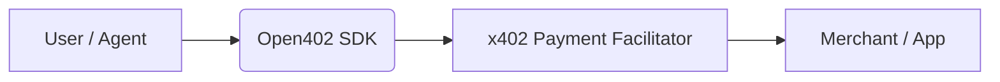

# 🧩 Open402 — The Open SDK for x402 Payments

**Open402** is an open-source SDK that makes it simple for any developer to integrate **x402 pay-per-request payments** into web or onchain applications — with **no KYC, no Coinbase account, and no friction**.

> “The easiest way to integrate x402 payments into your app.”

---

## 🚀 What is x402?

x402 is a new internet payment standard built on the unused HTTP code `402 – Payment Required`.  
It enables **onchain micropayments per request**, allowing websites, APIs, and AI agents to charge users automatically, **without subscriptions, API keys, or intermediaries**.

Open402 provides the missing bridge between your app and the x402 protocol — an SDK that lets you send and receive payments **in minutes**.

---

## ⚙️ Features

- ⚡ **Plug & Play** — integrate x402 in just a few lines of code.  
- 🔓 **Permissionless** — no KYC, no API key, no Coinbase account.  
- 🌐 **Universal** — works with any x402-compatible facilitator.  
- 🧠 **Developer Friendly** — simple SDK and example templates.  
- 💸 **Pay-per-request ready** — instant settlement, onchain.  

---

## 📦 Installation

You can install Open402 via **npm**:

```bash
npm install open402
````

or with **yarn**:

```bash
yarn add open402
```

---

## 🧠 Quick Start Example

Here’s a simple example showing how to use Open402 in your app:

```js
import { payWithOpen402 } from "open402"

// Example usage
await payWithOpen402({
  endpoint: "/api/data",
  amount: "0.01 USD"
})
```

When the request is executed, the x402 payment happens **automatically** — your app gets paid, and your user gets access.

---

## 🪄 How It Works

1. **User triggers a request** in your app.
2. **Open402 SDK** wraps the request into a **x402 payment**.
3. The transaction is processed instantly onchain.
4. Your endpoint receives the request only **after successful payment**.

Everything happens in one flow — **no API keys, no manual billing, no KYC**.

---

## 🌍 Example Use Cases

* Monetize APIs or AI endpoints by request.
* Allow agents or bots to pay autonomously per call.
* Build decentralized tools that earn revenue per action.
* Enable access-controlled data, content, or services.

---

## 🧩 Integration Flow (Conceptual)



---

## 🛠️ Developer Tools

Open402 includes helper functions and mock endpoints to test your integrations easily:

```bash
npx open402 dev
```

This command launches a local test environment for your SDK setup.

---

## 🧱 Example Implementation (Express.js)

```js
import express from "express"
import { verifyPayment } from "open402"

const app = express()

app.post("/api/data", async (req, res) => {
  const valid = await verifyPayment(req.headers)
  if (!valid) return res.status(402).send("Payment Required")

  res.json({ message: "Authorized access to data." })
})

app.listen(3000, () => console.log("Server running on port 3000"))
```

---

## 🧠 Philosophy

> “Payments should flow as freely as data.”

Open402 was built with one goal: to make **onchain payments** as seamless as HTTP itself — open, composable, and permissionless.

---

## 💻 Project Status

Open402 is currently in **early development**.
You can follow updates and new releases on our [GitHub page](https://github.com/Open402SDK) or on **Twitter** at [@Open402SDK](https://twitter.com/Open402SDK).

---

## ⚖️ License

MIT License — open for everyone to use, modify, and contribute.

---

## 💬 Contact

For questions, collaborations, or integration inquiries:

* 🌐 Website: [open402.dev](https://open402sdk.xyz)
* 🧵 Twitter: [@Open402SDK](https://twitter.com/Open402_SDK)
* 🧩 GitHub: [github.com/Open402SDK](https://github.com/Open402SDK)

---

Made with ❤️ for the new economy of APIs and agents.
